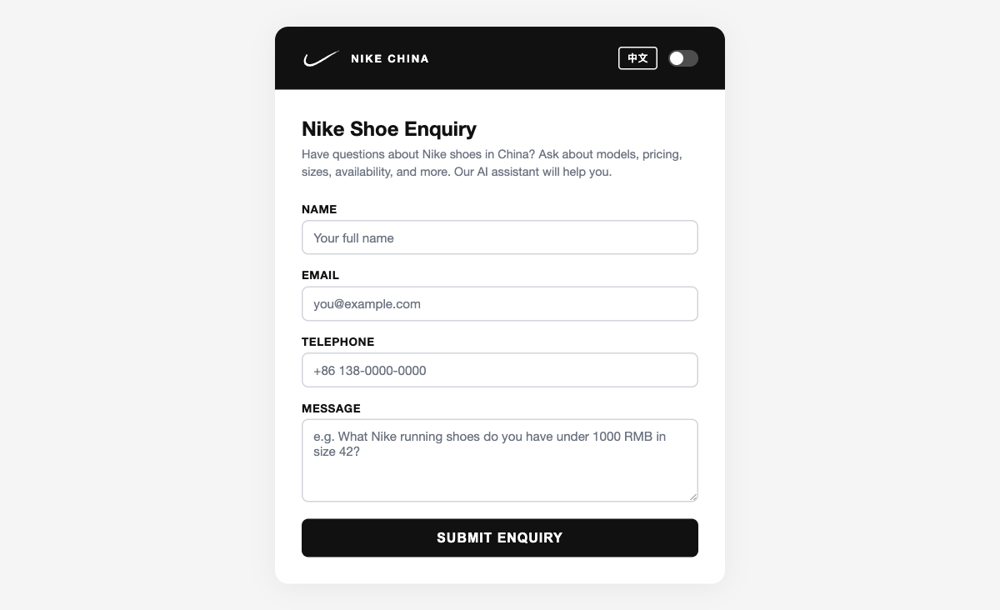

<div align="center">

# Nike China Customer Enquiry System

[](https://developer.mozilla.org/en-US/docs/Web/HTML)
[](https://developer.mozilla.org/en-US/docs/Web/CSS)
[](https://developer.mozilla.org/en-US/docs/Web/JavaScript)
[](https://n8n.io/)
[](https://openai.com/)
[](https://opensource.org/licenses/MIT)

**AI-powered customer service for Nike shoes in the China market with human-in-the-loop email approval**

[Live Demo](https://alfredang.github.io/n8nnike/) · [Report Bug](https://github.com/alfredang/n8nnike/issues) · [Request Feature](https://github.com/alfredang/n8nnike/issues)

</div>

## Screenshot



## About

A customer enquiry web form for Nike China that connects to an n8n AI agent workflow. Customers can ask about Nike shoe models, pricing (in RMB), sizes, availability, and stock levels. The AI agent uses RAG (Retrieval-Augmented Generation) to answer queries from a product catalog of 100 Nike shoe models, drafts a professional email reply, and sends it to a manager for approval before delivering to the customer.

### Key Features

- **Bilingual Support** — Switch between English and Chinese (中文) with one click
- **Dark / Light Theme** — Automatic detection with manual toggle
- **AI-Powered Responses** — RAG-based answers from Nike shoe product catalog
- **Human-in-the-Loop** — Manager reviews and approves AI-drafted emails before sending
- **Redraft Loop** — Manager can reject with feedback; AI revises and resubmits
- **100 Nike Shoe Models** — Catalog includes running, basketball, lifestyle, trail, training, and more

## Tech Stack

| Layer | Technology |
|-------|-----------|
| **Frontend** | HTML5, CSS3, JavaScript (vanilla) |
| **Automation** | n8n workflow engine |
| **AI / LLM** | OpenAI GPT-5 Mini via n8n LangChain agent |
| **RAG** | n8n In-Memory Vector Store + OpenAI Embeddings |
| **Email** | Gmail API (OAuth2) for approval and customer delivery |
| **Hosting** | GitHub Pages (frontend), Hostinger VPS (n8n) |

## Architecture

```
┌─────────────────────────────────────────────────────────────────┐
│                     GitHub Pages (Frontend)                     │
│  ┌───────────────────────────────────────────────────────────┐  │
│  │  Nike China Enquiry Form (EN / 中文, Dark / Light)        │  │
│  │  POST → n8n Webhook                                       │  │
│  └───────────────────────────────────────────────────────────┘  │
└─────────────────────────┬───────────────────────────────────────┘
                          │ JSON { name, email, tel, message, language }
                          ▼
┌─────────────────────────────────────────────────────────────────┐
│                     n8n Workflow (Backend)                       │
│                                                                 │
│  ┌─────────┐    ┌──────────┐    ┌────────────────────────────┐  │
│  │ Webhook  │───▶│ AI Agent │───▶│ Respond to Webhook (ack)   │  │
│  └─────────┘    │ (RAG)    │    └────────────────────────────┘  │
│                 └────┬─────┘                                    │
│                      │ draft                                    │
│                      ▼                                          │
│  ┌──────────────────────────────────────────────────────────┐   │
│  │  Store Draft → Gmail Send & Wait (to manager)            │   │
│  │       ▲              │                                    │  │
│  │       │              ▼                                    │  │
│  │       │       Check Approval                              │  │
│  │       │        ├── ✅ → Gmail Send (to customer)          │  │
│  │       │        └── ❌ → Prepare Feedback → Redraft Agent  │  │
│  │       │                                          │        │  │
│  │       └──────────────────────────────────────────┘        │  │
│  └──────────────────────────────────────────────────────────┘   │
│                                                                 │
│  ┌──────────────────────────────────────────────────────────┐   │
│  │  Vector Store: Nike shoe catalog (100 models)             │  │
│  │  Fields: Model, Price_RMB, Shoe_Type, Gender, Size, Stock │  │
│  └──────────────────────────────────────────────────────────┘   │
└─────────────────────────────────────────────────────────────────┘
```

## Project Structure

```
n8nnike/
├── index.html                          # Landing page with enquiry form
├── agent.json                          # n8n workflow (import into n8n)
├── nike_mock_china_100_updated.csv     # Nike shoe product catalog (100 models)
├── screenshot.png                      # App screenshot
└── README.md                           # This file
```

## Getting Started

### Prerequisites

- [n8n](https://n8n.io/) instance (self-hosted or cloud)
- OpenAI API key
- Gmail OAuth2 credentials (for email approval flow)

### Setup

1. **Clone the repository**
   ```bash
   git clone https://github.com/alfredang/n8nnike.git
   cd n8nnike
   ```

2. **Import the n8n workflow**
   - Open your n8n instance
   - Go to **Workflows** → **Import from File**
   - Select `agent.json`

3. **Upload the product catalog**
   - In n8n, trigger the **Upload Document** form
   - Upload `nike_mock_china_100_updated.csv` to populate the vector store

4. **Configure credentials in n8n**
   - Add your **OpenAI API key**
   - Configure **Gmail OAuth2** for the approval email flow
   - Set the manager approval email in the "Send Draft for Approval" node

5. **Activate the workflow** in n8n

6. **Open the form**
   - Open `index.html` in a browser, or
   - Visit the [live demo](https://alfredang.github.io/n8nnike/)

## Deployment

The frontend is deployed to **GitHub Pages** automatically via GitHub Actions. The n8n backend runs on a self-hosted VPS.

To deploy your own:
1. Fork this repository
2. Enable GitHub Pages in Settings → Pages → Source: GitHub Actions
3. Update the `WEBHOOK_URL` in `index.html` to point to your n8n instance

## Contributing

Contributions are welcome!

1. Fork the repository
2. Create your feature branch (`git checkout -b feature/amazing-feature`)
3. Commit your changes (`git commit -m 'Add amazing feature'`)
4. Push to the branch (`git push origin feature/amazing-feature`)
5. Open a Pull Request

Join the [Discussions](https://github.com/alfredang/n8nnike/discussions) for questions and ideas.

---

<div align="center">

### Developed by

**Tertiary Infotech Academy Pte. Ltd.**

### Acknowledgements

Built with [n8n](https://n8n.io/) · [OpenAI](https://openai.com/) · [Claude Code](https://claude.ai/claude-code)

If you found this useful, please give it a ⭐

</div>
